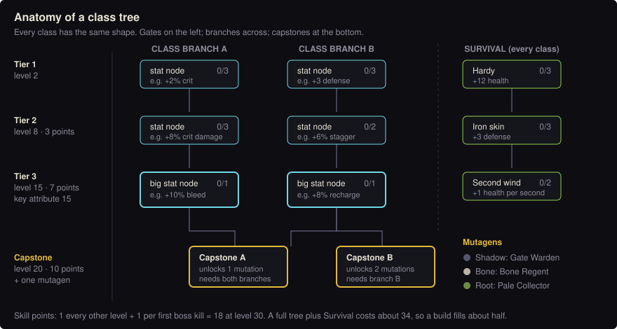

# Class trees: theorycraft

Status: proposal, with the first round of decisions folded in (see [Decisions](#decisions)). Builds on the rules in [skill-trees.md](skill-trees.md): tree nodes only grant
stats the game already has, mutations only change a skill's settings and add riders from a fixed list. Nothing here
is in the game yet.

## How a character grows

Four separate tracks, each with one job, so none of them overshadows gear:

| Track | Improves | Paid with | Where |
|---|---|---|---|
| **Attributes** (exists) | raw stats: Strength, Dexterity… | 3 points per level | Gear panel |
| **Class tree** | numbers, through the existing stat keys | skill points | Gear panel, new tab |
| **Skill rank** | the class skill's own settings (damage, cooldown) | shards + materials, level-gated | blacksmith |
| **Mutation** | lesser: a small bonus to a skill; greater: how a skill behaves | a capstone node + a boss mutagen | learned once, swapped at safe rooms |
| **Skill slots** | how many skills you can use at once, up to 4 (one an ultimate) | a runestone every 10 floors | safe rooms |



### Where skill points come from

- **1 every other level** (levels 2, 4, 6 …): 15 by level 30.
- **1 for each floor boss beaten the first time:** 3 today, one per new floor after that.
- At level 30 with floor 3 cleared that's **18 points**. Everything in a class's tree plus Survival costs about 34,
  so **a build fills about half of it**. Choosing what to skip is what makes builds differ.

### Gates

| Tier | Character level | Points already in this class's branches | Extra |
|---|---|---|---|
| 1 | 2 | 0 | – |
| 2 | 8 | 3 | – |
| 3 | 15 | 7 | the class's **key attribute at 15** (see each class) |
| Capstone | 20 | 10 | learning the mutation also takes **one mutagen** of its kind |

Survival points don't count toward these gates. A capstone is reachable by level 20 (13 points by then), but it
takes most of them.

The key-attribute requirement links attributes to the tree. A Swordsman who put everything into Vitality reaches
tier 3 later. That's a real trade-off, but a soft one, because attributes come at 3 per level.

### Trees per class, points per character

- Each class has **its own tree with two class branches**, plus a **Survival branch shared by every class**.
- A character **commits to one class**. Its tree, skill ranks, mutations and extra skill slots only work while
  you hold that class's weapon. Any other weapon still works, with its skill at rank 1 and no tree: fine for
  trying a class out, not for playing it.
- **Changing class** is deliberately expensive, so players research and pick the class they want: it costs
  **`150 × level` shards and 2 Spire crystals** at a blacksmith. At level 20 that's 3,000 shards, about five or
  six floor clears' worth, more than a rank 5 upgrade. What it does:
  - points in the old class's branches move to the new class's, unspent;
  - Survival points stay where they are;
  - skill ranks and learned mutations stay with the old class, waiting if you ever come back;
  - lesser mutations (below) are shared by all classes, so they carry over.
- **Respec** within your class at a blacksmith costs `50 × level` shards. Both respec and the first class change
  after the trees are rebalanced (`TREE_VERSION`, as in skill-trees.md) are free.

### Skill rank: improving the class skill

The active skill itself goes from rank 1 to 5 at a blacksmith. Each rank adds **+8% to the skill's damage or
healing and −4% to its cooldown**. Those are settings in the skills table, so this needs no new mechanics.

| Rank | Level | Shards | Materials |
|---|---|---|---|
| 2 | 5 | 200 | 3 Emberstone |
| 3 | 10 | 500 | 5 Emberstone, 1 Spire crystal |
| 4 | 15 | 1,000 | 3 Spire crystal |
| 5 | 20 | 2,000 | 5 Spire crystal, **materials not yet discovered** |

Rank 5's last ingredient is a mutagen from a **hidden boss**, which don't exist yet. Until they do, the blacksmith
shows rank 5 with its last row as `??? (not yet discovered)` and won't sell it. That keeps the top rank as
something to look forward to instead of a grind on the first three bosses.

Ranks are per skill, so every skill you slot (see [Skill slots](#skill-slots-and-the-ultimate)) has its own ladder.
This gives materials a second use besides enhancement.

### Mutagens and mutations

Mutations come in two strengths, and the strength follows how deep the mutagen comes from. The first floors' bosses
are the easiest to farm, so what they give must stay small, or players would mutate, one-shot those bosses and grind
them forever.

- **Lesser mutagens** (floors 1–3): **Shadow** (Gate Warden), **Bone** (Bone Regent), **Root** (Pale Collector).
  One is guaranteed on the first kill, then a 20% chance per kill, with a pity counter.
- A lesser mutagen teaches a **lesser mutation**: a minor stat bonus to one skill, and nothing else. They are the
  same for every class, so there are only three, and they need no new code:

  | Lesser mutation | Bonus to the skill it's on | Mutagen |
  |---|---|---|
  | Shadow-touched | −6% cooldown | Shadow |
  | Bone-touched | +6% damage or healing | Bone |
  | Root-touched | +8% area or reach | Root |

  Each is worth less than one skill rank, and the skill is only part of a build's damage, so overall it's a 1–3%
  change. Enough to want, not enough to break a boss.
- **Greater mutagens** come from deeper floors' bosses, none of which exist yet. They teach the **greater
  mutations** in each class's table below: the ones that change how a skill behaves. Their themes stay Shadow,
  Bone and Root, so each class's three greater mutations need a greater mutagen of that theme.
- **Learning** a mutation uses one mutagen and needs the capstone. After that, switching between learned
  mutations is free in any safe room. One mutation is equipped per skill at a time, lesser or greater.

So mutagens give every floor's boss a reason to be revisited through the floor gate, without making it profitable
to never leave.

### Skill slots and the ultimate

- A character starts with **one skill slot**, holding the class skill.
- Every 10th floor's boss drops a **runestone** on the first kill. Using one opens another slot. Floors 10, 20 and
  30 take you to the **maximum of 4**.
- The 4th slot is the **ultimate** slot: it only takes an ultimate, and an ultimate only goes there.
- Each class gets a pool to fill the slots from: **4 skills and 2 ultimates**. Slotting is free in a safe room;
  what you leave out is the build choice.
- Ultimates **charge from damage dealt and taken** rather than a cooldown, so one can't open a boss fight at full
  strength every time. Exact charge rates come with the first ultimate.
- Slots 2–4 get keys of their own when they arrive. Rank, mutation and tree bonuses that say "skill recharge"
  apply to every slotted skill except the ultimate.

The extra skills and ultimates are designed with the floors that award their slots; the first runestone is seven
floors away. Nothing below depends on them.

## The rider list

Mutations may only use these ten. Each is a small, reviewed piece of code, written once:

| Rider | Effect |
|---|---|
| `pull` | drags enemies hit toward you |
| `bleed` | hits bleed for a share of damage over 3 s |
| `stun` | stuns non-boss enemies hit for a short time |
| `burn` | fire damage over 3 s; counts as fire (burns bodies, double against Thornroots) |
| `chain` | jumps to more targets at reduced effect |
| `extraShots` | more projectiles or strikes |
| `lingers` | leaves an area that keeps working for a few seconds |
| `taunt` | enemies nearby target you for a few seconds |
| `holy` | extra damage to the undead (Bone soldiers, thralls) |
| `delay` | the effect lands after a marked delay, larger |

## The Survival branch (every class)

| Tier | Node | Ranks | Per rank |
|---|---|---|---|
| 1 | Hardy | 3 | +12 health (`hp`) |
| 1 | Light step | 3 | +2% move speed (`move`) |
| 2 | Iron skin | 3 | +3 defense (`def`) |
| 2 | Deep breath | 2 | +10 max mana (`mana`) |
| 3 | Second wind | 2 | +1 health per second (`regen`) |
| 3 | Studious | 2 | +4% experience (`xp`) |

14 points to fill it all. Most builds will take 3 to 6 here, since every point is one less in the class branches.

## Classes

Each class gets two class branches (5 nodes each, 3 tiers) and two capstones. The capstones unlock the lesser
mutations, and later three greater mutations between them; in some classes one capstone holds two. The greater
mutations below wait for deeper floors' mutagens. Node values follow the power budget in skill-trees.md: a
tier-1 rank is worth about +2% damage per second or +3% effective health, a tier-3 rank about +6%.

### Swordsman: Longsword and buckler, Circular slash. Key attribute: Strength

| Branch | Tier 1 | Tier 2 | Tier 3 |
|---|---|---|---|
| **Edge** | Keen edge: +2% crit ×3 · Long reach: +4% reach and arc ×2 | Brutal edge: +8% crit damage ×3 | Serrated: +10% bleed ×1 |
| **Guard** | Warded: +3 defense ×3 · Barbed: +6% reflect ×2 | Steady: +6% stagger chance ×2 | Riposte: +8% skill recharge ×1 |

| Greater mutation | Settings | Riders | Greater mutagen |
|---|---|---|---|
| Vortex | knockback −80 | `pull` | Shadow |
| Razor wind | ×1.6 damage | `bleed` | Bone |
| Second spin | spins twice at 60% | `lingers` | Root |

### Rogue: Dagger, Shadowstep. Key attribute: Dexterity

| Branch | Tier 1 | Tier 2 | Tier 3 |
|---|---|---|---|
| **Shadows** | Keen: +2% crit ×3 · Ruthless: +8% crit damage ×3 | Executioner: +8% damage below 30% health ×3 | Assassin: +10% skill recharge ×1 |
| **Venom** | Serrated: +6% bleed ×3 · Leech: +1% lifesteal ×2 | Quickening: +2% per-hit attack speed ×3 | Arcing: +6% arc chance ×1 |

| Greater mutation | Settings | Riders | Greater mutagen |
|---|---|---|---|
| Chain step | jumps to 2 more enemies at 60% | `chain` | Shadow |
| Hamstring | – | `stun` 1.2 s, `bleed` | Bone |
| Smoke step | leaves a smoke cloud | `lingers`, `stun` inside it | Root |

### Slayer: Greatsword, Sunder. Key attribute: Strength

| Branch | Tier 1 | Tier 2 | Tier 3 |
|---|---|---|---|
| **Ruin** | Giant-slayer: +6% vs elites and bosses ×3 · Brutal: +8% crit damage ×2 | Executioner: +8% below 30% ×3 | Cleave: +8% reach and arc ×1 |
| **Momentum** | Quickening: +2% per-hit attack speed ×3 · Sweeping: +4% reach ×2 | Staggering: +5% stagger ×3 | Unstoppable: +3 defense, +12 health ×1 |

| Greater mutation | Settings | Riders | Greater mutagen |
|---|---|---|---|
| Earthsplitter | shape: a 120 px line instead of an arc | – | Shadow |
| Bloodletting | – | `bleed` | Bone |
| Shatter | Sunder's +25% becomes +40% | – | Root |

### Tank: Mace and heavy shield, Bulwark. Key attribute: Vitality

| Branch | Tier 1 | Tier 2 | Tier 3 |
|---|---|---|---|
| **Bastion** | Stalwart: +12 health ×3 · Warded: +3 defense ×3 | Mending: +1 health per second ×2 | Unbroken: +12% skill recharge ×1 |
| **Retribution** | Barbed: +8% reflect ×3 · Staggering: +5% stagger ×2 | Heavy hand: +8% crit damage ×3 | Shield bash: +6% reach ×1 |

| Greater mutation | Settings | Riders | Greater mutagen |
|---|---|---|---|
| Taunt | Bulwark also calls enemies within 80 px | `taunt` | Shadow |
| Thornmail | reflect +50% while Bulwark lasts | – | Bone |
| Shield wall | allies within 40 px also take 30% less | `lingers` | Root |

The Tank is the class that makes party play matter: Taunt and Shield wall only shine with others around.

### Lancer: Spear, Piercing line. Key attribute: Strength

| Branch | Tier 1 | Tier 2 | Tier 3 |
|---|---|---|---|
| **Reach** | Sweeping: +5% reach ×3 · Keen: +2% crit ×2 | Brutal: +8% crit damage ×3 | Long shadow: +8% skill recharge ×1 |
| **Impale** | Staggering: +5% stagger ×3 · Executioner: +6% below 30% ×2 | Giant-slayer: +6% vs elites and bosses ×3 | Pinning: +10% bleed ×1 |

| Greater mutation | Settings | Riders | Greater mutagen |
|---|---|---|---|
| Harpoon | – | `pull` | Shadow |
| Skewer | – | `stun` 1 s | Bone |
| Javelin | thrown: flies 200 px | `extraShots` (a second spear at 50%) | Root |

### Archer: Bow, Volley. Key attribute: Dexterity

| Branch | Tier 1 | Tier 2 | Tier 3 |
|---|---|---|---|
| **Marksman** | Keen: +2% crit ×3 · Brutal: +8% crit damage ×3 | Focused: +5% skill recharge ×2 | Deadeye: +8% damage below 30% ×1 |
| **Hunter** | Fleet: +2% move ×3 · Arcing: +5% arc chance ×2 | Staggering: +5% stagger ×3 | Leech: +2% lifesteal ×1 |

| Greater mutation | Settings | Riders | Greater mutagen |
|---|---|---|---|
| Arrow rain | 9 arrows, wider spread | `extraShots` | Shadow |
| Pinning shot | one arrow at ×4 | `stun` | Bone |
| Fire arrows | – | `burn` (burns bodies, melts Thornroots) | Root |

### Mage: Grimoire of embers, Fireball. Key attribute: Intelligence

| Branch | Tier 1 | Tier 2 | Tier 3 |
|---|---|---|---|
| **Pyromancy** | Searing: +4% magic damage ×3 · Bursting: +6% blast radius ×2 | Smouldering: +10% burn ×3 | Inferno: +8% magic damage ×1 |
| **Arcana** | Deep: +10 max mana ×3 · Flowing: +8% mana regeneration ×3 | Adept: +4% skill recharge ×2 | Scholar: +3 intelligence ×1 |

| Greater mutation | Settings | Riders | Greater mutagen |
|---|---|---|---|
| Meteor | lands after a 0.8 s marked circle, ×1.6 | `delay` | Shadow |
| Twin flame | two smaller orbs at 60% | `extraShots` | Bone |
| Firewall | leaves a burning patch for 3 s | `lingers`, `burn` | Root |

Firewall makes the Mage the answer to floor 3's bodies.

### Healer: Grimoire of grace, Heal. Key attribute: Faith

| Branch | Tier 1 | Tier 2 | Tier 3 |
|---|---|---|---|
| **Mercy** | Merciful: +5% healing ×3 · Swift: +5% recharge ×2 | Lingering: +10% heal over time ×3 | Devout: +3 faith ×1 |
| **Sanctuary** | Warding: +4% damage reduction after Heal ×3 · Deep: +10 max mana ×2 | Flowing: +8% mana regeneration ×3 | Mending: +1 health per second ×1 |

| Greater mutation | Settings | Riders | Greater mutagen |
|---|---|---|---|
| Sanctuary | heals over 5 s in a circle that stays | `lingers` | Shadow |
| Smite | Heal also strikes the undead nearby | `holy` | Bone |
| Chain heal | jumps to 2 more allies at 70% | `chain` | Root |

## Sanity checks

- **Gear stays king.** Measured with the game's own damage-per-second score (`weaponScore`, level 20, Strength 15),
  a full Swordsman Edge branch adds **+8.9%**; the Slayer's Ruin and Momentum branches add +12.6% and +18.0%.
  Going from a common +0 to a legendary +10 longsword is ×3.8 ([enhancement wiki](../wiki/enhancement.md)).
  Trees shape a build; gear powers it.
- **The branch values above are first drafts.** Momentum is worth twice Edge today, which is exactly what the
  balance report in `npm test` is meant to catch. Expect the numbers to move before anything ships.
- **Early bosses can't be trivialised.** Everything the first three floors can give a skill (rank 4, a lesser
  mutation) adds up to about +30% on the skill alone, which is a fraction of a build's damage. Rank 5 and the
  greater mutations come from places that don't exist yet.
- **Floor 3 doesn't need mutations.** The Mage's Fireball already burns bodies; everyone else can kill
  Gravecallers mid-channel. The greater mutations add more answers (Fire arrows, Firewall, Chain step, Harpoon,
  Taunt, Smite) for when players come back through the floor gate.
- **Greater mutations are sidegrades.** None is strictly better than another; each changes what situations the
  skill is for. The balance report in `npm test` (skill-trees.md, step 3) will flag any that are not.
- **The rider list is closed.** All 24 greater mutations use the same ten riders, plus settings. A new mutation costs a
  table entry and no new code, unless it brings a new rider, which is a deliberate decision.

## Save format

```js
S.cls     = 'Swordsman'                // committed class; changing it is the fee above
S.skillPts                             // unspent
S.tree    = {sword:{edge1:3, guard1:1}, survival:{hardy:2}}
S.rank    = {circle:2}
S.mutagen = {shadow:1, bone:0, root:2}  // greater and hidden mutagens get their own keys later
S.learned = ['lesser.bone']
S.mut     = {circle:'lesser.bone'}     // equipped, per skill
S.runes   = 0                          // runestones used
S.slots   = ['circle']                 // slotted skills; length is 1 + runes
S.treeV   = 1                          // a mismatch refunds every point and makes the next class change free
```

## Order of work

Following skill-trees.md, with the decisions above making the early steps smaller:

1. Settings into the skills table (no behaviour change).
2. Committed class, the class change fee, the tree and the Survival branch, starting with the Swordsman.
3. Skill ranks 2–4 at the blacksmith, rank 5 shown as undiscovered.
4. Mutagen drops and the three lesser mutations: settings only, no riders yet.
5. The screens, then the other seven classes' trees.
6. Riders and greater mutations, when the first deeper floor brings a greater mutagen. The Swordsman's three need
   `pull`, `bleed` and `lingers`, which cover half of what the others need.
7. Skill slots, runestones and ultimates, when floor 10 is in sight.

## Decisions

1. **Changing class costs a hefty fee** (`150 × level` shards and 2 Spire crystals), so players research and
   commit. Points move with you; ranks and mutations wait with the old class.
2. **Mutagens stay as easy to get as proposed,** but what the first floors' mutagens teach is a minor stat bonus
   (lesser mutations), so early bosses can't be farmed into one-shots. Behaviour-changing mutations come from
   deeper floors.
3. **Rank 5 needs a hidden boss's mutagen.** Until hidden bosses exist, its last material reads "not yet
   discovered".
4. **No second active skill from the tree.** Instead, a runestone every 10 floors opens a skill slot, up to 4,
   and the 4th is an ultimate.

## Open questions

1. Is `150 × level` shards + 2 crystals hefty enough? It's tuned so a level 20 class change costs more than a
   rank 5 upgrade. Easy to raise.
2. Pool size per class: 4 skills + 2 ultimates for 3 + 1 slots means each build leaves one of each out. More
   choice means more skills to design and balance.
3. Hidden bosses: a separate design. Where they hide (a sealed room, a condition on a floor, a rare spawn) decides
   how they're found.
