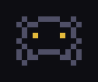
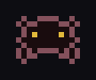
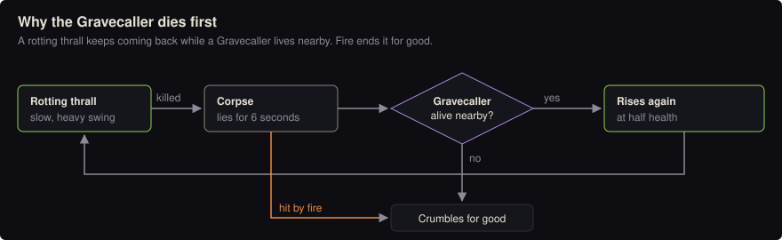
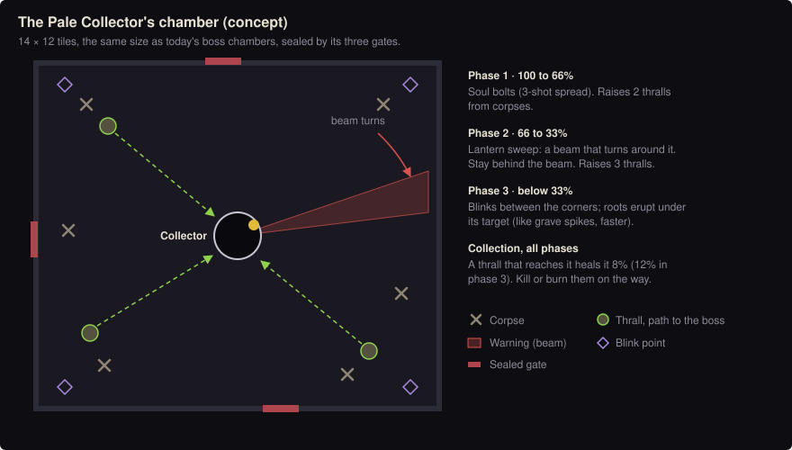

# Floor 3: The Rootbound Ossuary

Status: proposal for discussion. Nothing here is in the game yet.

## Why this theme

Each floor should teach one new thing and favour a different playstyle than the last:

| Floor | Teaches | Favours | Punishes |
|---|---|---|---|
| 1, shadows | wind-ups and dodging | anything | standing still |
| 2, the dead | positioning and facing (axis movement, shields) | steel | mages (magic resisted 75 to 85%) |
| **3, roots and the restless dead** | **target priority**: kill the support first | **fire and area damage**, healers | ignoring the back line |

Roots have broken into the crypt from above, so floor 3 continues floor 2's story. It also brings mages back after
floor 2 was hard on them: plants burn, and fire stops the dead from rising again.

## Enemies

| Enemy | Role | Behaviour | Counter |
|---|---|---|---|
| **Rotting thrall** | slow tank | Shambles in with a heavy, slow swing. When killed it collapses into a corpse for 6 s; if a Gravecaller is alive nearby, the corpse rises again at half health. | Kill the Gravecaller first, or burn the corpse (fire damage destroys it). |
| **Gravecaller** | priority caster | Keeps its distance and channels for 1.2 s to raise a corpse. A hit interrupts the channel. Blinks away when you close in (on a cooldown). Low health. | Rush it, or interrupt with ranged hits. |
| **Thornroot** | stationary hazard | Grows from wall faces next to rooms and corridors. Lashes along a telegraphed line. Cannot be knocked back. Takes double damage from fire. | Read the line, burn it, or go around. |
| **Bloodbloom** | healer | A rooted flower that pulses a visible green ring every 4 s, healing nearby enemies. Fragile. | Kill it first, or the fight drags on. |
| Carried over | filler | Bone archers (fewer than floor 2), and skitters recoloured as carrion beetles. | As before. |

 →  The skitter today, and a carrion beetle made by recolouring it (concept)

The beetles are a colour swap of an existing sprite (the tint system does this for free). That's the cheap way to
fill out a roster.

Elite Gravecallers raise two corpses at once.

### Environment

- **Thorn patches:** a new floor tile that slows by 40% and pricks for small damage. They mark the edges of rooms
  and push fights into the open.
- Root and bone decoration on a new tileset (a third entry in `THEMES`).

## Boss: The Pale Collector

`BOSSES` already names floor 3's boss: *The Pale Collector*, a gaunt necromancer carrying a lantern of souls. The
arena starts with six corpses on the floor.

1. **100 to 66%:** soul bolts (a three-shot spread; ordinary shots, so they can be evaded and knocked down). Raises
   two thralls from the arena's corpses. **Collection:** living thralls walk to the boss, and each one that reaches it
   heals it by 8%. Kill or burn them on the way.
2. **66 to 33%:** **lantern sweep**, a beam telegraph that rotates around the boss (new telegraph type: a rotating
   line); stay behind it. Raises three thralls.
3. **Below 33%:** blinks between the arena's corners, and roots erupt under the target (reusing the grave spikes
   telegraph, faster). Collection heals 12%.

What it tests: target priority (the thralls heading for it), area damage, and movement. Parties split naturally:
one player intercepts thralls while another fights the boss.

## Rewards: the first unique drops and monster-type bonuses

Floor 3 is the natural place to introduce two systems the wiki already has placeholders for.

**Monster families and bonuses.** Each enemy gets a family (`shadow`, `undead`, `plant`, later `beast`) and
optional weaknesses (`plant: fire ×1.5`). New weapon affixes roll on any weapon: *Purging* (+% damage to undead),
*Pruning* (+% damage to plants), *Banishing* (+% damage to shadows). The monster wiki then lists, for each enemy, the
affixes that work on it and where they drop.

**Unique items** in a `UNIQUES` table, each with fixed bonuses and one special effect, dropped by specific enemies:

| Unique | Type | Special | Source | Chance |
|---|---|---|---|---|
| Gravecaller's Tome | grimoire of embers | Fireball kills leave a burning patch for 3 s | Gravecaller | 1% (elite 5%) |
| Thornheart | charm | reflect 20% of damage taken; regenerate while standing still | Thornroot | 1% |
| Soulreaver | greatsword | each kill restores 2% of your health | The Pale Collector | 8% per kill |

Each player gets a **pity counter** per unique: every failed roll raises the next one's chance a little, so nobody
farms forever. Uniques are never sold in shops.

## Engineering, in order

1. **A floors table** (`FLOORS` in data.js): theme, spawn bag, boss id and intro banner per floor. This replaces the
   `n===2` checks in `genFloor`, `updateBoss` and the banner. Boss behaviours go in a registry (`BOSS_AI[id]`).
2. **Families, weaknesses and family affixes.** Small: data, plus one multiplier in `damageEnemy`, plus the
   "one bucket per kind of bonus" fix from the skill-tree design.
3. **The `UNIQUES` table, unique drop rolls and pity**, in the loot code (`dropLoot`), with the wiki listing them by
   enemy.
4. **New enemy behaviours:** corpse-and-raise, interruptible channels, wall-spawned stationary enemies (placed on
   wall-face tiles next to floor), healing pulses.
5. **The thorn tile.**
6. **The Pale Collector.**
7. **Art:** four enemies, the boss and a tileset, via `tools/make_sprites.py`. Beetles are a recolour.

Steps 1 to 3 are worth doing before any content: every later floor needs them. Rough size: steps 1 to 3 take
about a week; steps 4 to 7 another one to two, with the art as the long pole.

## Open questions

- Do raised thralls keep coming as long as a Gravecaller lives, or does each corpse rise at most once?
- Unique drop rates and pity speed: rare chase item, or reachable in an evening?
- Thorn tiles: do they hurt enemies too (so you can pull enemies through them)?
- Should floor 3 also cap the light radius (a darker floor), or is that saved for a later one?
