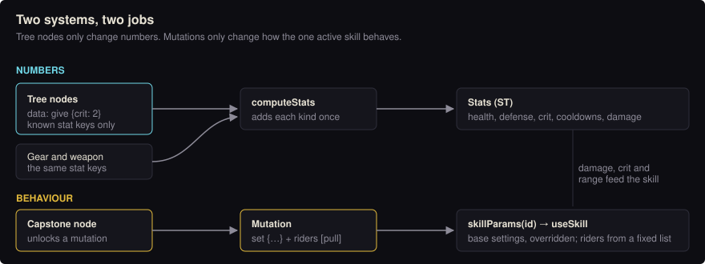
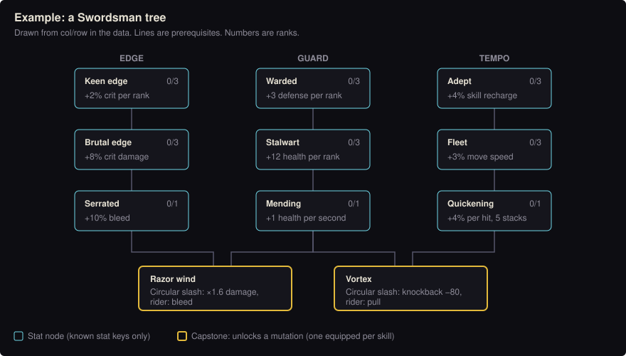

# Skill trees and mutations

Status: proposal. Goal: depth without a system nobody can reason about. The rule of thumb: **new content should be
data, and new code should be rare and deliberate.**

## Two systems, two jobs

| | Skill tree | Mutation |
|---|---|---|
| Changes | numbers (crit, defense, cooldown, health) | the active skill's **behaviour** |
| Code touched | `computeStats` only | the skill's implementation only |
| Shape | ~15 small nodes per class | 1 slot per skill, choose 1 of 2–3 |
| Unlocked by | skill points (1 per level, 1 per first boss kill) | a capstone node in the tree |

Never mix them: no node changes behaviour, no mutation grants flat stats. Every change then has one obvious home.



## Tree nodes: a closed vocabulary

`computeStats` already understands a fixed set of keys: weapon passives in `st.p` (`keen`, `brutal`, `bleed`,
`lifesteal`, `focus`, ...) and gear affixes in `st.g` (`hp`, `def`, `crit`, `cdr`, `move`, ...). **Nodes may only grant
those keys.**

```js
// data.js
const TREES={
  sword:{nodes:{
    edge1:{col:0,row:0,max:3,give:{crit:2}},
    edge2:{col:0,row:1,max:3,give:{brutal:8},need:['edge1']},
    guard1:{col:1,row:0,max:3,give:{def:3}},
    vortex:{col:1,row:3,max:1,mutation:'circle.vortex',need:['guard1','edge2']},
  }},
};
```



`computeStats` folds tree grants into the same maps as gear (about five lines, written once). A new node is then a
line of data. A genuinely new mechanic must arrive as a new affix or a new rider (below), which is a reviewed code
change, never a side effect of a node.

## Mutations: settings and riders, not branches

Step one is to move each skill's hard-coded numbers into `SKILLS`. Today `useSkill` calls
`hitArc(0,360,ST.range*1.35,2.2,{kb:120})`; afterwards:

```js
circle:{cd:5,mp:14,arc:360,reach:1.35,mult:2.2,kb:120},
```

A mutation may only (1) override those settings and (2) add **riders** from a small fixed list (`pull`, `bleed`,
`stun`, `burn`, `chain`, `extraShots`, `lingers`, ...):

```js
const MUTATIONS={
  'circle.vortex':{name:'Vortex',set:{kb:-80},riders:['pull']},
  'circle.razor': {name:'Razor wind',set:{mult:1.6},riders:['bleed']},
  'volley.rain':  {name:'Arrow rain',set:{shots:9,spread:.3},riders:[]},
};
```

The skill reads `skillParams(id)` = base settings + the equipped mutation. Code grows with the number of riders
(target: no more than 10, ever), not with the number of mutations or their combinations.

## Keeping the numbers in hand

- **One bucket per kind of bonus.** All "% more damage" sources add together, then apply once. Today execute,
  giant-slaying and Sunder each multiply damage separately, so they compound; fix that before adding a tree.
- **A power budget per tier,** e.g. a tier-1 node is worth about +3% damage per second or effective health. A
  balance script built on `computeStats` (it has no side effects) flags nodes far over budget.
- **Respec costs shards, and is free when the tree changes.** Store `TREE_VERSION` in the save; a mismatch refunds
  every point. That makes rebalancing safe.
- **Ids are forever.** Saves store node ids, never indexes. A renamed id is a new node; `migrateSave` drops unknown
  ids and refunds their points.

## Save, server, UI

- Save: `S.tree={sword:{edge1:2,...}}`, `S.mut={circle:'circle.vortex'}`, `S.skillPts`, `S.treeV`.
- New actions in `actions.js`: `learn(node)`, `mutate(skill,id)`, `respec()`. They are validated by the same code
  in single player and online, so the server gets this for free.
- The tree screen is drawn from `col`/`row` in the data. No hand-built layouts.

## The harness (in `npm test`)

1. **Data check:** every `give` key is a known stat; every `need` exists and there are no loops; every mutation
   names a real skill and only known riders.
2. **Save check:** a save with stale or unknown ids loads cleanly and refunds points.
3. **Balance report:** best build per class at levels 1, 10, 20 and 30 (damage per second and effective health),
   failing when a step jumps more than an agreed percentage.

## Order of work (each step is one playable PR)

1. Move skill numbers into `SKILLS` (no behaviour change; existing tests prove it).
2. Riders plus mutations for Circular slash only, chosen from the debug menu.
3. Tree data, the `computeStats` hookup, the learn/respec actions, data and save checks.
4. The tree screen, drawn from the data.
5. The Swordsman complete (about 15 nodes, 3 mutations). Playtest before going further.
6. The other six classes, which by then are mostly design and data.

Before step 5, write a one-page brief per class: identity, three branch themes, mutation list. Anything that does not
fit the rules above gets discussed first, not coded.
