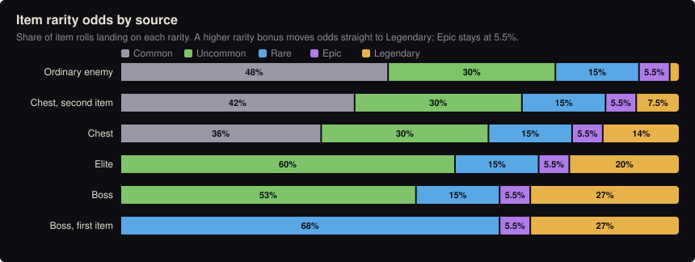
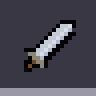
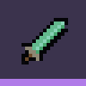
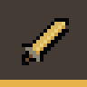

# Drops

> Generated by `node tools/wiki.js` from the game's data. Do not edit by hand: change the data (js/sim) or the notes in tools/wiki.js, then run it again.

Every kill rewards **every player on the floor**, and each player gets their **own roll** of the loot: nobody can take
your drops, and only you see them. Each chest opens once per player. Bosses return whenever you arrive on a floor, so
their loot can be farmed.

## What drops from what

On the ground:  shards  potion  ration  water flask  Iron scrap  Emberstone  Spire crystal  Shade essence  Old bone  Thornwood  Chitin plate (monster drops, the diamonds)  an item (rare and better ones also send a beam of their colour into the dark).

| Source | Shards (floor 1 / 2 / 3) | Items | Potions, rations, water | Materials | Its family’s drop |
|---|---|---|---|---|---|
| Ordinary enemy | 1–4 / 1–5 / 2–6 | 13% | 5.5% health potion 4.0% ration 5.0% water flask | Iron scrap: 30% for 1 Emberstone: 3.0% for 1 | 30% for 1 |
| Elite enemy | 14 / 18 / 21 | 70%, at least uncommon | 30% health potion 25% ration 30% water flask | Iron scrap: 1 to 3 Emberstone: 40% for 1 Spire crystal: 4.0% for 1 | 2 to 3 |
| Floor boss | 60 / 75 / 90 | 1 (item level +1), at least rare 1 (item level +1), at least uncommon 1 (item level +1), at least uncommon | 2 health potions 1 ration 1 water flask | Iron scrap: 4 to 6 Emberstone: 2 to 3 Spire crystal: 1 | 6 to 8 |
| Chest | 8–16 / 10–20 / 12–24 | 1 35% | 50% health potion 40% ration 50% water flask | Iron scrap: 1 to 2 Emberstone: 25% for 1 | – |

Rations and water flasks refill the hunger and thirst meters. Traders in safe rooms also sell them, 5–10 of each supply, restocked when the floor’s boss falls.

Elites are 7.0% of room spawns, marked by gold outlines and eyes. They have 2.4× health and 1.3× damage, and give 3× experience.

## Item rarity odds

 Common &nbsp;  Uncommon &nbsp;  Rare &nbsp;  Epic &nbsp;  Legendary

Each item roll has a rarity bonus that shifts the odds. Rarity multiplies an item's base numbers and sets how many bonuses it carries.

| Roll | Common | Uncommon | Rare | Epic | Legendary |
|---|---|---|---|---|---|
| Ordinary enemy | 48% | 30% | 15% | 5.5% | 1.5% |
| Chest, second item | 42% | 30% | 15% | 5.5% | 7.5% |
| Chest | 36% | 30% | 15% | 5.5% | 14% |
| Elite | – | 60% | 15% | 5.5% | 20% |
| Boss | – | 53% | 15% | 5.5% | 27% |
| Boss, first item | – | – | 68% | 5.5% | 27% |

| Rarity | Stat multiplier | Bonuses (weapon, armor, boots) | Bonuses (grimoire, trinket) |
|---|---|---|---|
| Common | 1× | 0 | 1 |
| Uncommon | 1.15× | 1 | 2 |
| Rare | 1.32× | 1 | 2 |
| Epic | 1.55× | 2 | 3 |
| Legendary | 1.85× | 2 | 3 |

## What kind of item

| Slot | Chance | Types (equally likely) |
|---|---|---|
| Weapon | 42% |  Longsword  Dagger  Greatsword  Mace  Spear  Bow  Grimoire |
| Armor | 24% |  Tunic  Leather jerkin  Longcoat  Plate cuirass |
| Boots | 17% |  Boots  Greaves  Striders |
| Trinket | 17% |  Ring, Charm, Band |

A grimoire is equally likely to be of embers (Fireball, intelligence) or of grace (Heal, faith). Items drop at the
floor's item level (bosses: one higher), which raises base numbers by 22% per level.

## Average yield per kill

| Source | Shards (floor 1) | Items | Iron scrap | Emberstone | Spire crystal | Its family’s drop |
|---|---|---|---|---|---|---|
| Ordinary enemy | 2.5 | 0.13 | 0.30 | 0.03 | – | 0.30 |
| Elite enemy | 14 | 0.70 | 2 | 0.40 | 0.04 | 2.50 |
| Floor boss | 60 | 3 | 5 | 2.50 | 1 | 7 |
| Chest | 12 | 1.35 | 1.50 | 0.25 | – | – |

## Where each enemy appears

| Floor | Enemies (share of room spawns) | Also | Boss |
|---|---|---|---|
| 1 | Shade 38%, Skitter 38%, Brute 13%, Wisp 13% | – | The Gate Warden |
| 2 | Bone soldier 38%, Bone archer 25%, Bone knight 13%, Skitter 13%, Wisp 13% | – | The Bone Regent |
| 3 and up | Rotting thrall 38%, Gravecaller 25%, Ossuary hermit 13%, Bloodbloom 13%, Bone archer 13% | Thornroot on the top wall of 55% of rooms; thorn patches | The Pale Collector |

## Monster drops

Every monster belongs to a **family**, and each family has its own drop. A monster only ever drops its own
family’s, on top of everything above; chests have no family and drop none. The blacksmith and the arcanist turn
them into gear against that family: see [Forging](forging.md). The exchange buys and sells them: see
[The market](market.md).

| Family | Drop | Ordinary monsters (chance per kill) | Elites | Bosses |
|---|---|---|---|---|
| Spirits |  Shade essence | Shade: 30% for 1 Skitter: 30% for 1 Brute: 30% for 1 Wisp: 30% for 1 | 2 to 3 | The Gate Warden: 6 to 8 |
| Undead |  Old bone | Bone soldier: 30% for 1 Bone archer: 30% for 1 Bone knight: 30% for 1 Rotting thrall: 30% for 1 Gravecaller: 30% for 1 | 2 to 3 | The Bone Regent: 6 to 8 The Pale Collector: 6 to 8 |
| Plants |  Thornwood | Thornroot: 60% for 1 Bloodbloom: 30% for 1 | 2 to 3 | none yet |
| Beasts |  Chitin plate | Ossuary hermit: 1 to 2 | 2 to 3 | none yet |

Tough monsters that are rare for their family roll better than the usual 30% for 1: Thornroot, Ossuary hermit.
The dead that a Gravecaller or the Pale Collector raises drop nothing, like the rest of their loot.

## Unique drops

**Not in the game yet.** Apart from its family’s drop, every enemy rolls from the same pool above. One-of-a-kind
items from particular enemies and bosses are planned: see [docs/design/floor-3.md](../design/floor-3.md). When they
land, this page lists them by enemy.
