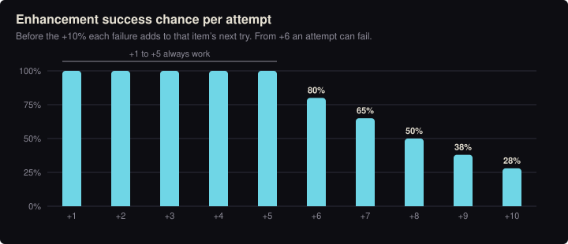

# Enhancement and item stats

> Generated by `node tools/wiki.js` from the game's data. Do not edit by hand: change the data (js/sim) or the notes in tools/wiki.js, then run it again.

## Enhancing

The blacksmith (at the forge, in the root village) enhances weapons, armor and boots up to +10. Each level adds
8% to the item's base numbers, so +10 is ×1.8. Trinkets cannot be enhanced.
Up to +5 an attempt always works. From +6 it can fail: the level stays, the cost is spent, and that item's next
attempt gets +10% (shown on the item), until it succeeds.

| Level | Materials per attempt | Chance | Average attempts | Materials to get here from +0, on average (scrap / ember / crystal) |
|---|---|---|---|---|
| +1 | 1 Iron scrap | 100% | 1 | 1 / 0 / 0 |
| +2 | 2 Iron scrap | 100% | 1 | 3 / 0 / 0 |
| +3 | 3 Iron scrap | 100% | 1 | 6 / 0 / 0 |
| +4 | 3 Iron scrap, 1 Emberstone | 100% | 1 | 9 / 1 / 0 |
| +5 | 3 Iron scrap, 2 Emberstone | 100% | 1 | 12 / 3 / 0 |
| +6 | 3 Iron scrap, 3 Emberstone | 80% | 1.22 | 15.7 / 6.7 / 0 |
| +7 | 3 Emberstone, 1 Spire crystal | 65% | 1.45 | 15.7 / 11.0 / 1.5 |
| +8 | 3 Emberstone, 2 Spire crystal | 50% | 1.77 | 15.7 / 16.3 / 5.0 |
| +9 | 3 Emberstone, 3 Spire crystal | 38% | 2.13 | 15.7 / 22.7 / 11.4 |
| +10 | 3 Emberstone, 4 Spire crystal | 28% | 2.53 | 15.7 / 30.3 / 21.5 |

### Shard cost

Each attempt costs `22 × (current level + 1) × (1 + 0.3 × (item level − 1)) × rarity multiplier` shards, rounded.
Average shards to take an item from +0 to +10, failures included:

| Item level | Common | Uncommon | Rare | Epic | Legendary |
|---|---|---|---|---|---|
| 1 | 2,006 | 2,307 | 2,645 | 3,111 | 3,712 |
| 2 | 2,608 | 3,000 | 3,446 | 4,042 | 4,825 |
| 3 | 3,211 | 3,690 | 4,238 | 4,976 | 5,938 |
| 4 | 3,812 | 4,384 | 5,033 | 5,909 | 7,052 |

### Salvaging

Salvaging gives `6 × (1 + 0.22 × (item level − 1)) × rarity multiplier³ × (1 + 0.5 × level)` shards, plus materials:

| Rarity | Materials back |
|---|---|
| Common | 1 Iron scrap |
| Uncommon | 2 Iron scrap |
| Rare | 3 Iron scrap |
| Epic | 4 Iron scrap, 1 Emberstone |
| Legendary | 5 Iron scrap, 2 Emberstone, 1 Spire crystal |

A [forged](forging.md) piece also returns a third of the monster drops that went into it: 4 from a weapon, 3 from armor, 2 from boots.

## Weapon damage range

Lowest possible (common, +0, low roll) to highest possible (legendary, +10, high roll), per item level.
Base rolls vary ±5%.

| Weapon | Class | Attacks/s | Reach | Item level 1 | Item level 2 | Item level 3 | Item level 4 |
|---|---|---|---|---|---|---|---|
|  Longsword | Swordsman | 1.6 | 26, 110° | 11.4–42.0 | 13.9–51.2 | 16.4–60.4 | 18.9–69.7 |
|  Dagger | Rogue | 3.2 | 19, 80° | 6.2–22.7 | 7.5–27.7 | 8.9–32.7 | 10.3–37.7 |
|  Greatsword | Slayer | 0.85 | 34, 150° | 24.7–90.9 | 30.1–110.9 | 35.6–130.9 | 41.0–150.9 |
|  Mace | Tank | 1.25 | 24, 100° | 15.2–55.9 | 18.5–68.3 | 21.9–80.6 | 25.2–92.9 |
|  Spear | Lancer | 1.4 | 44, thrust | 12.3–45.5 | 15.1–55.5 | 17.8–65.5 | 20.5–75.5 |
|  Bow | Archer | 1.5 | 150 (shot) | 9.5–35.0 | 11.6–42.7 | 13.7–50.3 | 15.8–58.0 |
|  Grimoire | Mage | 1.5 | 135 (shot) | 8.5–31.5 | 10.4–38.4 | 12.3–45.3 | 14.2–52.2 |

## Armor and boots range

Same rule: common +0 to legendary +10. Move speed bonuses do not grow with rarity or level.

| Item | Stat | Item level 1 | Item level 2 | Item level 3 | Item level 4 |
|---|---|---|---|---|---|
|  Tunic | Defense | 4–13 | 5–16 | 6–20 | 7–22 |
| Tunic | Health | 10–34 | 12–41 | 14–49 | 17–56 |
|  Leather jerkin | Defense | 7–23 | 9–29 | 10–34 | 12–38 |
| Leather jerkin | Health | 16–54 | 20–65 | 23–77 | 27–88 |
|  Longcoat | Defense | 6–20 | 7–25 | 9–29 | 10–32 |
| Longcoat | Health | 10–34 | 12–41 | 14–49 | 17–56 |
| Longcoat | Move | +3% | +3% | +3% | +3% |
|  Plate cuirass | Defense | 14–47 | 17–58 | 20–67 | 23–77 |
| Plate cuirass | Health | 30–101 | 37–122 | 43–144 | 50–166 |
| Plate cuirass | Move | -4% | -4% | -4% | -4% |
|  Boots | Defense | 2–7 | 2–9 | 3–9 | 3–11 |
| Boots | Move | +4% | +4% | +4% | +4% |
|  Greaves | Defense | 5–16 | 6–20 | 7–23 | 8–27 |
| Greaves | Move | +1% | +1% | +1% | +1% |
|  Striders | Defense | 1–4 | 1–4 | 1–5 | 2–5 |
| Striders | Move | +7% | +7% | +7% | +7% |

## Bonus (affix) ranges by rarity

A bonus's value is rolled when the item drops; a higher rarity raises both ends. Values below are at item level 1;
"grows" marks bonuses that also rise 22% per item level. Enhancement does not change bonuses.

### Weapons (any but grimoires)

| Bonus | Effect | Common | Uncommon | Rare | Epic | Legendary | Grows |
|---|---|---|---|---|---|---|---|
| Leeching | Heal N% of damage dealt | 2–4 | 2–4 | 3–5 | 3–5 | 3–5 |  |
| Serrated | Hits bleed for N% damage over 3s | 20–38 | 23–40 | 25–43 | 28–45 | 30–45 |  |
| Keen | +N% critical chance | 5–10 | 6–11 | 6–11 | 7–12 | 8–12 |  |
| Brutal | +N% critical damage | 20–41 | 23–44 | 26–47 | 29–50 | 32–50 |  |
| Executioner’s | +N% damage to enemies below 30% health | 25–50 | 29–53 | 32–57 | 36–60 | 39–60 |  |
| Quickening | Each hit gives +N% attack speed for 3s, up to 5 stacks | 4–8 | 5–8 | 5–9 | 6–9 | 6–9 |  |
| Sweeping | +N% reach and arc | 10–18 | 11–20 | 12–21 | 14–22 | 15–22 |  |
| Staggering | N% chance to stun for 0.8s | 8–15 | 9–16 | 10–17 | 11–18 | 12–18 |  |
| Focused | Skill recharges N% faster | 10–21 | 12–22 | 13–24 | 15–25 | 16–25 |  |
| Giant-slaying | +N% damage to elites and floor bosses | 15–29 | 17–31 | 19–33 | 21–35 | 23–35 |  |
| Arcing | N% chance to arc half damage to a second enemy | 15–26 | 17–27 | 18–29 | 20–30 | 21–30 |  |

### Grimoires of embers

| Bonus | Effect | Common | Uncommon | Rare | Epic | Legendary | Grows |
|---|---|---|---|---|---|---|---|
| Scholar’s | +N intelligence | 2–4 | 2–4 | 3–5 | 3–5 | 3–5 | yes |
| Searing | +N% magic damage | 8–16 | 9–18 | 10–19 | 12–20 | 13–20 |  |
| Bursting | +N% Fireball blast radius | 15–29 | 17–31 | 19–33 | 21–35 | 23–35 |  |
| Smouldering | Fireball burns for N% damage over 3s | 25–46 | 28–49 | 31–52 | 34–55 | 37–55 |  |

### Grimoires of grace

| Bonus | Effect | Common | Uncommon | Rare | Epic | Legendary | Grows |
|---|---|---|---|---|---|---|---|
| Devout | +N faith | 2–4 | 2–4 | 3–5 | 3–5 | 3–5 | yes |
| Merciful | +N% healing from Heal | 10–21 | 12–22 | 13–24 | 15–25 | 16–25 |  |
| Lingering | Heal restores a further N% over 5s | 30–51 | 33–54 | 36–57 | 39–60 | 42–60 |  |
| Swift | Heal recharges N% faster | 10–21 | 12–22 | 13–24 | 15–25 | 16–25 |  |
| Warding | Take N% less damage for 4s after Heal | 10–18 | 11–20 | 12–21 | 14–22 | 15–22 |  |

### Armor, boots and trinkets

| Bonus | Effect | Common | Uncommon | Rare | Epic | Legendary | Grows |
|---|---|---|---|---|---|---|---|
| Stalwart | +N health | 12–25 | 14–26 | 16–28 | 17–30 | 19–30 | yes |
| Warded | +N defense | 3–7 | 4–7 | 4–8 | 5–8 | 5–8 | yes |
| Fleet | +N% move speed | 3–6 | 3–6 | 4–7 | 4–7 | 5–7 |  |
| Hunter’s | +N% critical chance | 2–5 | 2–5 | 3–6 | 3–6 | 4–6 |  |
| Mending | +N health per second | 1–2 | 1–3 | 1–3 | 2–3 | 2–3 |  |
| Barbed | Reflect N% of damage taken | 10–21 | 12–22 | 13–24 | 15–25 | 16–25 |  |
| Seeker’s | +N% experience | 5–10 | 6–11 | 6–11 | 7–12 | 8–12 |  |
| Adept’s | Skill recharges N% faster | 5–10 | 6–11 | 6–11 | 7–12 | 8–12 |  |
| Deep | +N max mana | 8–15 | 9–16 | 10–17 | 11–18 | 12–18 | yes |
| Flowing | +N% mana regeneration | 10–21 | 12–22 | 13–24 | 15–25 | 16–25 |  |
