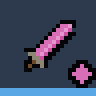
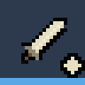
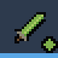
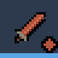

# Forging

> Generated by `node tools/wiki.js` from the game's data. Do not edit by hand: change the data (js/sim) or the notes in tools/wiki.js, then run it again.

Every monster belongs to a **family** and drops that family’s own material (the diamonds on the ground). In the
root village those drops are made into gear **against that family**:

- a forged **weapon** deals more damage to every monster and boss of the family;
- forged **armor** and **boots** take less damage from them, shots included, and worn together the two add up.

Against everything else a forged piece is an ordinary rare piece, so it is a tool to bring to the floors where
that family lives, not a replacement for your best gear.

## Where

- **The blacksmith**, at the forge in the market: every weapon but grimoires, every armor, every pair of boots.
- **The arcanist**, at the witchcraft room next door: grimoires, of embers or of grace.

Talk to either (E), pick a family, then a piece. Trinkets cannot be forged.

## What it costs and what you get

| Piece | Monster drops | Iron scrap | Shards at item level 1 | Shards at item level 2 | Shards at item level 3 | Shards at item level 4 | Bonus |
|---|---|---|---|---|---|---|---|
| Weapon | 12 | 4 | 80 | 104 | 128 | 152 | +15% to +25% damage to the family |
| Armor | 10 | 3 | 60 | 78 | 96 | 114 | 10% to 20% less damage taken from the family |
| Boots | 6 | 2 | 40 | 52 | 64 | 76 | 5% to 10% less damage taken from the family |

- A forged piece is always **Rare** (1.32× base numbers) with a rare piece’s usual random bonus: 1 on a weapon, armor or boots, 2 on a grimoire, from its own school.
- Its **item level** is the highest floor you have reached, the same as the village market’s stock. Shards cost 30% more per level; the drops do not.
- The **size of the bonus** is rolled when the piece is made, anywhere in its range. Forging again rolls again.
- It can be **enhanced** like any other piece; enhancing raises its base numbers, not the family bonus.
- **Salvaging** it returns a third of the drops (4 from a weapon, 3 from armor, 2 from boots), with the usual shards and scrap.
- Drops, chests and shops never carry a family bonus: forging is the only source.

## The families

| Family | Drop | Weapon | Armor and boots | Who is in it |
|---|---|---|---|---|
| Spirits |  Shade essence |  Shadebane |  Shadeward | Shade, Skitter, Brute, Wisp, The Gate Warden |
| Undead |  Old bone |  Gravebane |  Graveward | Bone soldier, Bone archer, Bone knight, Rotting thrall, Gravecaller, The Bone Regent, The Pale Collector |
| Plants |  Thornwood |  Thornbane |  Thornward | Thornroot, Bloodbloom |
| Beasts |  Chitin plate |  Beastbane |  Beastward | Ossuary hermit |

The corner diamond on a forged piece’s icon is its family’s colour. How often each monster drops its family’s
material is on the [Drops](drops.md#monster-drops) page.

## How the bonus is counted

- **Weapons.** Every "% more damage" bonus adds up and is applied once: the family bonus, *Giant-slaying* (elites and
  bosses), *Executioner’s* (below 30% health) and Sunder’s mark (+25%). A +20% Gravebane greatsword with +30%
  Giant-slaying deals +50% to an elite bone soldier. Critical hits, magic resistance and fire weakness still multiply
  on top. Hits that got the family bonus show their number in orange (critical hits stay yellow).
- **Armor and boots.** The family’s share comes off after defense: with 20% armor and 10% boots, the most
  that can be forged, a blow from that family does 70% of what it would have.
- Thorn patches belong to no family, so nothing forged helps against them.
