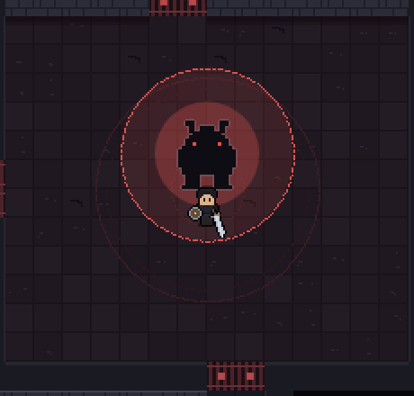
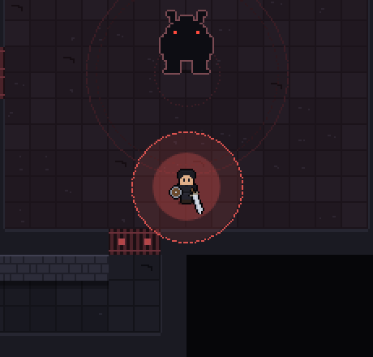
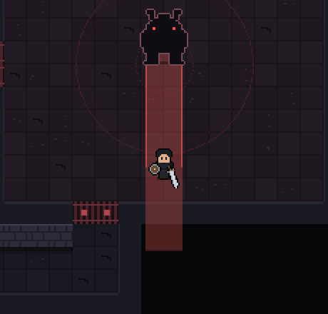
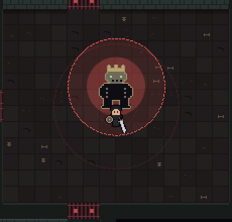
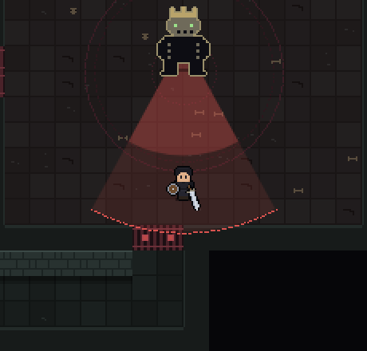
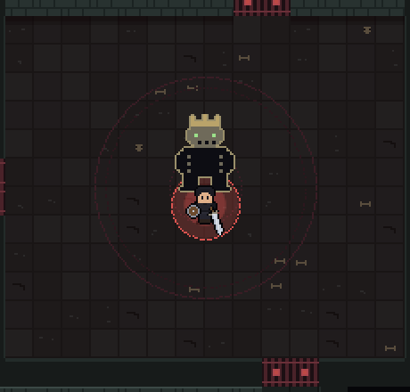
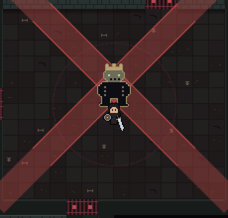

# Monsters

> Generated by `node tools/wiki.js` from the game's data. Do not edit by hand: change the data (js/sim) or the notes in tools/wiki.js, then run it again.

Enemies get tougher on every floor: health +38%, damage +22% and experience +30% per floor above the first.
Elites (gold) have 2.4× health and 1.3× damage. Damage shown is before your defense, which removes
`defense / (100 + defense)` of each blow.

**Weapons with a bonus against a monster type: none yet.** The only targeted bonus today is the weapon affix
*Giant-slaying* (extra damage to elites and bosses), and the dead take less magic damage (below). Monster-type
bonuses are planned (see [docs/design/floor-3.md](../design/floor-3.md)); this page will list them and where they
drop. Until then, any source can drop any weapon: the best odds of a good one are elites (70% item chance, at least
uncommon) and bosses (three items, one item level higher).

## Shade

  Ordinary and elite

|  | Floor 1 | Floor 2 | Floor 3 |
|---|---|---|---|
| Health (elite) | 34 (82) | 47 (113) | 60 (144) |
| Damage per hit (elite) | 9.0 (11.7) | 11.0 (14.3) | 13.0 (16.8) |
| Experience (elite) | 9 (27) | 12 (35) | 14 (43) |

- **Found on floors:** 1
- **Speed:** 40
- **How it fights:** Walks straight at you, winds up for 0.38 s, then swipes. Any hit during the wind-up cancels it.
- **How to beat it:** The baseline enemy. Hit it while it winds up and it never lands a blow.
- **Recommended attributes:** Strength or the attribute your weapon scales with; Vitality while learning.

## Skitter

  Ordinary and elite

|  | Floor 1 | Floor 2 | Floor 3 |
|---|---|---|---|
| Health (elite) | 15 (36) | 21 (50) | 26 (63) |
| Damage per hit (elite) | 5.0 (6.5) | 6.1 (7.9) | 7.2 (9.4) |
| Experience (elite) | 5 (15) | 7 (20) | 8 (24) |

- **Found on floors:** 1, 2+
- **Speed:** 74
- **How it fights:** Fast (74 speed) and fragile, with a short 0.22 s wind-up. Comes in groups, and the Gate Warden summons them.
- **How to beat it:** Wide arcs (Greatsword, Longsword, Circular slash) clear a group in one swing. Keep moving so they come to you in a line.
- **Recommended attributes:** Agility (attack speed) or Strength.

## Brute

  Ordinary and elite

|  | Floor 1 | Floor 2 | Floor 3 |
|---|---|---|---|
| Health (elite) | 110 (264) | 152 (364) | 194 (465) |
| Damage per hit (elite) | 19.0 (24.7) | 23.2 (30.1) | 27.4 (35.6) |
| Experience (elite) | 20 (60) | 26 (78) | 32 (96) |

- **Found on floors:** 1
- **Speed:** 26 · **heavy** (not staggered by hits)
- **How it fights:** Slow and heavy: hits do not stagger it and barely knock it back. A long 0.75 s wind-up into a 19-damage blow.
- **How to beat it:** Watch for the wind-up and dodge-roll through it, or raise a shield. Sunder (+25% damage taken) pays off on its large health pool.
- **Recommended attributes:** Vitality, or Dexterity for evasion. Shield classes can block it.

## Bone soldier

  Ordinary and elite

|  | Floor 1 | Floor 2 | Floor 3 |
|---|---|---|---|
| Health (elite) | 46 (110) | 63 (152) | 81 (194) |
| Damage per hit (elite) | 11.0 (14.3) | 13.4 (17.4) | 15.8 (20.6) |
| Experience (elite) | 12 (36) | 16 (47) | 19 (58) |

- **Found on floors:** 2+
- **Speed:** 46 · **ignores 75% of magic damage**
- **How it fights:** Moves along one axis at a time and lunges in a straight line when lined up with you. Half the time it hops back out of a melee swing aimed at it.
- **How to beat it:** Step off its line before the lunge, then punish the recovery. Ignores 75% of magic damage: bring steel.
- **Recommended attributes:** Strength. Mages struggle here.

## Bone archer

  Ordinary and elite

|  | Floor 1 | Floor 2 | Floor 3 |
|---|---|---|---|
| Health (elite) | 26 (62) | 36 (86) | 46 (110) |
| Damage per hit (elite) | 10.0 (13.0) | 12.2 (15.9) | 14.4 (18.7) |
| Experience (elite) | 13 (39) | 17 (51) | 21 (62) |

- **Found on floors:** 2+
- **Speed:** 40 · **ranged** · **ignores 75% of magic damage**
- **How it fights:** Sidesteps onto your row or column, draws for 0.45 s, then looses an arrow along that line. Hops away if you get within 46 px.
- **How to beat it:** Never stand on its row or column for long. Rush it between shots; corners break its line. Ignores 75% of magic damage.
- **Recommended attributes:** Dexterity (evasion, up to 30%) and Agility (move speed).

## Bone knight

  Ordinary and elite

|  | Floor 1 | Floor 2 | Floor 3 |
|---|---|---|---|
| Health (elite) | 140 (336) | 193 (464) | 246 (591) |
| Damage per hit (elite) | 21.0 (27.3) | 25.6 (33.3) | 30.2 (39.3) |
| Experience (elite) | 26 (78) | 34 (101) | 42 (125) |

- **Found on floors:** 2+
- **Speed:** 30 · **heavy** (not staggered by hits) · **ignores 85% of magic damage** · **shield**
- **How it fights:** Its shield stops everything from the side it faces while it walks or stands, but it only re-faces you every 0.75 s. Heavy 0.7 s wind-up, then a long 1.1 s recovery.
- **How to beat it:** Hit it from the side or behind, or during its recovery. Shadowstep (Dagger) lands behind it with a guaranteed critical. Ignores 85% of magic damage.
- **Recommended attributes:** Strength and Agility.

## Wisp

  Ordinary and elite

|  | Floor 1 | Floor 2 | Floor 3 |
|---|---|---|---|
| Health (elite) | 22 (53) | 30 (73) | 39 (93) |
| Damage per hit (elite) | 8.0 (10.4) | 9.8 (12.7) | 11.5 (15.0) |
| Experience (elite) | 11 (33) | 14 (43) | 18 (53) |

- **Found on floors:** 1, 2+
- **Speed:** 32 · **ranged**
- **How it fights:** Floats at 52 to 92 px, firing a slow orb every 2 to 2.6 s. Its shots stop at walls and safe rooms.
- **How to beat it:** Close in. A melee swing knocks its shots out of the air, and a raised shield blocks them.
- **Recommended attributes:** Any. Ranged classes outtrade it.

## Floor bosses

Base health 520 and damage 22, scaled by floor like everything else (floor 2: 718 health).
Telegraphed attacks (red markings) cannot be evaded by Dexterity; shields cut them by less than ordinary blows. If
everyone inside the chamber falls, the boss heals to full.

### The Gate Warden

*Floor 1 (and every floor from 3 until those get their own bosses)*

- Slam: a red circle around itself when you are close (48 px). Leave the circle.
- Targeted burst: a red circle where you stand, from range. Move off it.
- Charge: a red lane, then it runs along it. Step sideways.
- Calls skitters at 66% and 33% health: 3, plus 1 per floor above 1 (6 at most).
- Below 30% health everything comes faster.

Every attack is telegraphed and cannot be evaded by Dexterity, but it can be dodge-rolled. Clear the skitters with wide swings.

What each warning looks like, just before it lands:

| Slam | Targeted burst | Charge lane |
|---|---|---|
|  |  |  |

### The Bone Regent

*Floor 2*

- Slam around itself, as the Gate Warden.
- Rib volley: seven bone shards in a cone. Ordinary shots: Dexterity can evade them and a melee swing knocks them down.
- Grave spikes: four bursts (five when enraged) under whoever it targets, 0.3 s apart. They come up from below, so no shield stops them: keep moving.
- Bone cross: four lanes through the boss; the gaps between them are safe. Below 30% health a diagonal cross follows.
- Raises two bone soldiers at 66% and 33% health.
- Never uses the same attack twice in a row.

Takes half damage from magic. Its own shield blocks nothing, so any steel weapon works.

What each warning looks like, just before it lands:

| Slam | Rib volley | Grave spikes (one burst) | Bone cross (diagonal) |
|---|---|---|---|
|  |  |  |  |
